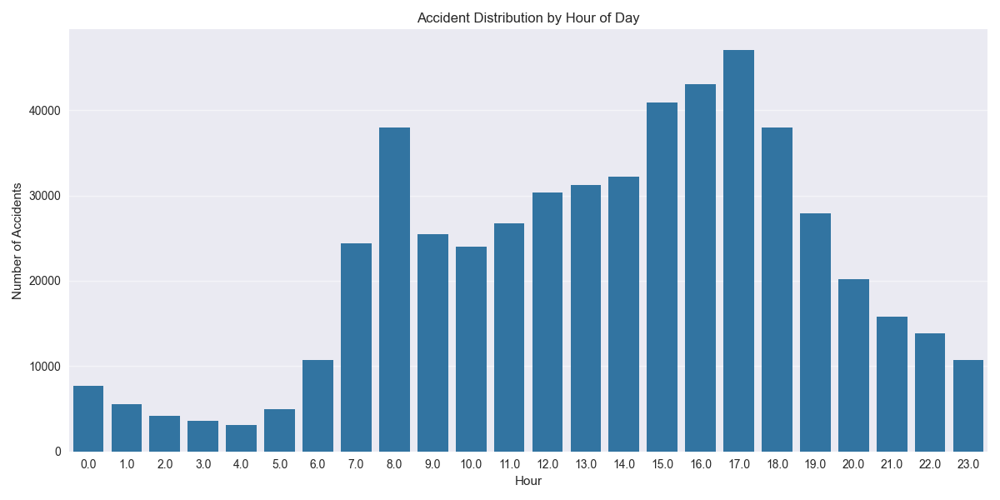
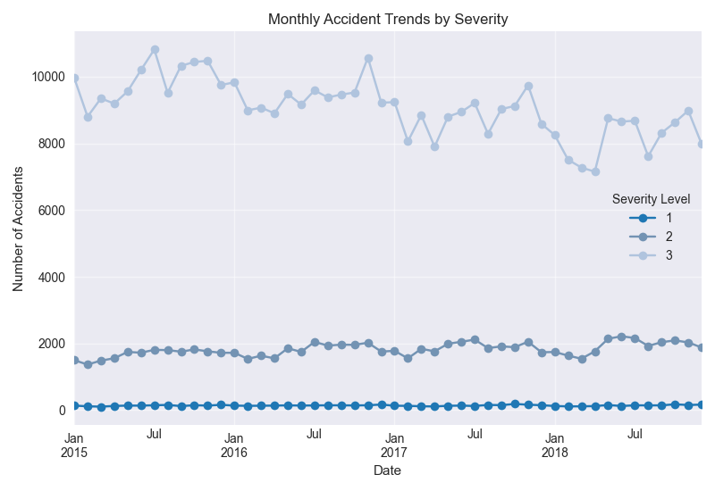
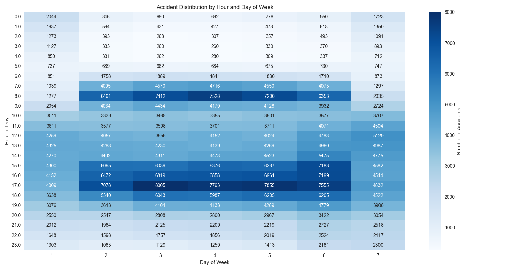
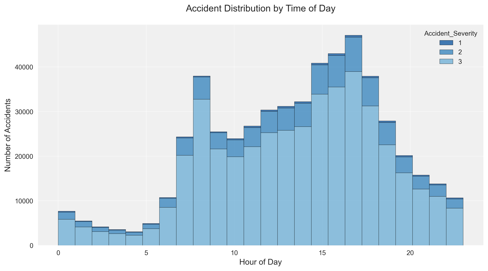

# UK Traffic Accident Analysis (2015-2018)


## Overview
A comprehensive analysis of UK road safety data from 2015-2018, examining over 529,294 traffic accidents to understand patterns, risk factors, and potential intervention points for improving road safety.

[](https://opensource.org/licenses/MIT)

[](https://public.tableau.com/)

## Table of Contents
- [Project Overview](#overview)
- [Data Sources](#data-sources)
- [ETL Process](#etl-process)
- [Analysis & Findings](#analysis--findings)
- [Visualizations](#visualizations)
- [Interactive Dashboards](#interactive-dashboards)
- [Key Findings](#key-findings)
- [Recommendations](#recommendations)
- [Technologies Used](#technologies-used)
- [Installation](#installation)
- [Usage](#usage)
- [License](#license)
- [Contact](#contact)

## Data Sources
The analysis utilizes three main datasets:
- Accidents Data (2015-2018)
- Casualties Data (2015-2018)
- Vehicles Data (2015-2018)

Total records analyzed: 529,294 accidents
- Fatal Accidents: 6,658
- Serious Accidents: 87,462
- Slight Accidents: 435,174

## ETL Process
1. **Data Validation and Structure Assessment**
   - Performed initial data comparison between redundant datasets
   - Validated matching data between directories
   - Confirmed 100% match for all datasets

2. **File Structure Standardization**
   - Implemented consistent naming conventions
   - Standardized file organization
   - Created unified directory structure

3. **Data Transformation**
   - Converted timestamps from UK to US format
   - Resolved time format inconsistencies
   - Implemented datetime validation checks

4. **Data Cleaning**
   - Executed custom cleaning scripts
   - Performed error correction
   - Ensured format consistency
   - Generated comprehensive cleaning reports

5. **Data Consolidation**
   - Created master files for:
     - Accidents
     - Casualties
     - Vehicles

## Analysis & Findings

### 1. Temporal Analysis
- Peak accident times during rush hours (7-9 AM and 4-6 PM)
- Higher severity rates during nighttime (11 PM - 4 AM)
- Distinct weekend vs weekday patterns

### 2. Weather Impact
- Adverse weather significantly affects accident severity
- Rain: Higher frequency, lower average severity
- Snow/Ice: Lower frequency, higher severity rates

### 3. Road and Speed Analysis
- Single carriageways show highest accident rates
- Strong correlation between speed limits and severity
- Urban roads: High frequency, lower severity
- Motorways: Low accident rates despite high speeds

### 4. Casualty Analysis
- Young adults (18-25): Higher representation
- Elderly (65+): Higher severity rates
- Distinct pedestrian and cyclist patterns

## Visualizations





## Interactive Dashboards
Access the interactive Tableau dashboards:
- [Location and Time Analysis](https://public.tableau.com/views/uksafetydata/LocationTimeofDayandYear)
- [Severity and Weather Analysis](https://public.tableau.com/views/uksafetydata2/Dashboard1)

## Technologies Used
- Python 3.8+
- Pandas
- NumPy
- Matplotlib
- Seaborn
- Tableau
- Jupyter Notebook

## Installation
```bash
# Clone the repository
git clone https://github.com/guzmanwolfrank/uk-traffic-analysis.git

# Navigate to project directory
cd uk-traffic-analysis

# Install required packages
pip install -r requirements.txt
```

## Recommendations
1. **Smart Infrastructure Implementation** (15-20% potential reduction)
   - AI-powered traffic management
   - Dynamic speed limits
   - Connected vehicle infrastructure

2. **Enhanced Education Programs** (10-15% potential reduction)
   - Continuous learning systems
   - Virtual reality hazard training
   - Vulnerable user awareness

3. **Technology-Based Solutions** (20-25% potential reduction)
   - Advanced driver assistance systems
   - Vehicle-to-vehicle communication
   - Automated emergency braking

## License
This project is licensed under the MIT License - see the [LICENSE.md](LICENSE.md) file for details.

## Contact
Wolfrank Guzman
- GitHub: [@guzmanwolfrank](https://github.com/guzmanwolfrank)
- Website: [wolfrankguzman.com](https://wolfrankguzman.com)

## Acknowledgments
- UK Department for Transport for providing the accident data
- Contributors and reviewers who helped improve this analysis
- The open-source community for the tools and libraries used
